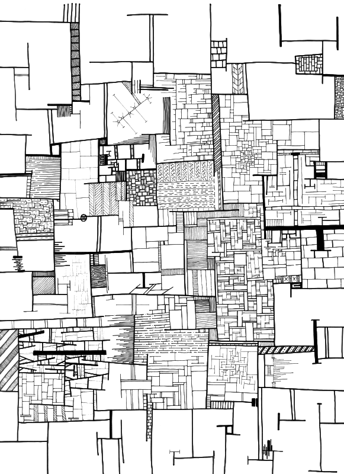

# 'The farm' by Saar Drimer

This digitised artwork is made by scanning of pen on card artwork and then performing a 'bitmap tracing' and layering in Inkscape. Opening the SVG in [Inkscape](https://inkscape.org) allows turning the layers on and off.

## License

This artwork is provided under the provisions of

Attribution-NonCommercial-ShareAlike 4.0 International (CC BY-NC-SA 4.0)  
https://creativecommons.org/licenses/by-nc-sa/4.0/

For commercial use contact me at saardrimer@gmail.com

Copyright © 2020, Saar Drimer
